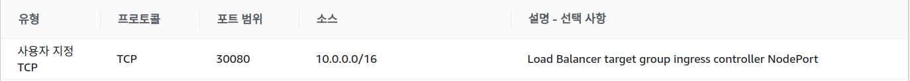

앞에서 pod와 svc를 배포하고 운영중인것을 확인했다. 클러스터 밖에서 요청을 보내기 위한 3가지 방법이 있다.

1. ```kubectl port-forward```를 사용해서 인증된 접근하기

   앞에서 사용한 방법으로, 테스트목적으로 파드의 포트를 연결하여 바로 접근하는 방법이다.

2. API proxy를 통해 인증된 접근하기

   이 방법도 테스트 목적으로 쿠버네티스 서비스에 접근할 수 있도록 하는 방식이다.

3. 인그레스를 통해 SVC에 public 접근하기

   모든 사람이 접근할 수 있도록 쿠버네티스 서비스를 통해 정의된 앱을 공개하는 방법이다. 앞으로 이 방법을 사용할 것이다.


ingress는 클러스터 외부/내부에서 들어온 요청이 목적하는 svc에 route되는 rule을 제공하는 API 객체이다.

그리고 ingress controller는 ingress 정보를 읽고 적절하게 처리하는 역할을 한다. 다양한 ingress controller가 있기 때문에 트래픽의 종류와 클러스터에 들어오는 로드 유형에 맞는 것을 선택하는것이 중요하다.

ingress controller도 결국 private subnet에 있기 때문에 외부에서 들어오는 요청을 적절한 ingress controller로 보내주는 역할을 할 것이 필요하다. 이 역할을 하는 것이 로드밸런서이다.

따라서 NGINX ingress controller를 사용하고 Network LoadBalancer(NLB)를 생성해 외부에서 Nginx ingress controller에 접근하게 하려고 한다. path기준으로 로드밸런싱할 필요가 없고, 어떤 svc인지만 알고 부하분산하면 되기 때문에 ALB가 아닌 NLB를 사용한다.

> 로드밸런서 종류

- ELB : Classic Load Balancer

- NLB : Network Load Balancer

  L4레벨(네트워크 계층)에서 로드밸런싱

  Client에서 서버로 들어오는 트래픽은 로드밸런서를 통하고 나가는 트래픽은 client와 직접 통신

  할당한 Elastic IP를 Static IP로 사용 가능

- ALB : Application Load Balancer

  L7레벨(어플리케이션 계층)에서 로드밸런싱

  Client와 서버 사이 들어오고 나가는 트래픽이 모두 로드밸런서와 통신

  IP주소가 변동되므로 DNS 이름을 이용해야한다.


### 1. Ingress controller 생성하기

우선 helm을 설치하고 다음 명령어로 사용할 repo를 추가한다.

```
helm repo add stable https://kubernetes-charts.storage.googleapis.com
```

ingress controller를 위한 ns를 생성하고

```
# ingress_ns.yaml
apiVersion: v1
kind: Namespace
metadata:
  name: ingress-nginx
```

 ```https://github.com/kuberkuber/infra/blob/master/example/nginx/value.yaml```에 있는 코드를 사용해서 ingress-controller를 띄운다.

```
helm install ingress-nginx stable/nginx-ingress --namespace ingress-nginx -f value.yaml
```

밑에서 로드밸런서 target group을 생성할 때 라우트 할 port를 ingress controller svc의 nodeport로 설정한다.


### 2. Ingress 설정하기

```
apiVersion: extensions/v1beta1
kind: Ingress
metadata:
  name: INGRESS_NAME
  namespace: NAMESPACE
spec:
  rules:
  - host: PREFIX.CLUSTER_ID.kuberkuber
    http:
      paths:
      - path: /
        backend:
          serviceName: SERVICE_NAME
          servicePort: SERVICE_PORT
```

```INGRESS_NAME``` : 속한 namespace 안에서 유니크해야한다.

```NAMESPACE``` : expose하려는 svc의 namespace이다. ingress는 svc와 반드시 같은 ns에 있어야한다.

```PREFIX``` : 클러스터의 모든 인그레스에서 유니크해야한다. INGRESS_NAME과 똑같이해도된다.

```CLUSTER_ID``` : svc가 띄워져 있는 클러스터의 ID

```SERVICE_NAME``` : svc의 ```.metadata.name```과 같아야한다.

```SERVICE_PORT``` : svc의 ```.spec.ports[].port```와 같아야 한다.

**위에서 보면 expose하려는 svc와 그 svc를 등록한 ingress는 같은 ns에 있어야 한다. 사용자마다 ns를 생성할 것이므로 사용자마다 ingress가 하나씩 있어야한다.**


### 3. Network Load Balancer(NLB) 생성하기

```
resource "aws_lb" "nlb" {
  name                       = "${var.cluster_name}-cluster"
  internal                   = false
  load_balancer_type         = "network"
  enable_deletion_protection = true
  subnets                    = [aws_subnet.cluster-0.id,aws_subnet.cluster-1.id]
  tags = {
    "kubernetes.io/service-name"                  = "ingress-nginx/ingress-nginx-nginx-ingress-controller"
    "kubernetes.io/cluster/${var.cluster_name}" = "owned"
  }
}
```

```load_balancer_type```을 network로 해주어야 네트워크 로드밸런서가 생성된다.

외부에서 요청을 받을 것이기 때문에 ```internal```도 false로 한다.


### 4. NLB 리스너 생성하기

NLB로 들어오는 요청을 받을 리스너를 생성한다.

```
resource "aws_lb_listener" "http" {
  load_balancer_arn = aws_lb.nlb.arn
  port              = "80"
  protocol          = "TCP"

  default_action {
    type             = "forward"
    target_group_arn = aws_lb_target_group.http.arn
  }
}
```


### 5. target group과 target 생성하기

로드밸런서가 라우팅할 target group과 target을 생성한다.

대상 그룹을 생성할 때 ```target_type```으로 instance를 지정하는 방법과 ip를 지정하는 방법이 있는데  document에 다음과 같이 나와있다.

[**인스턴스 ID를 사용하여 target을 지정하는 경우 클라이언트의 원본 IP 주소가 보존되고 애플리케이션에 제공됩니다. **] ~~따라서 id를 지정해본다.~~ 이렇게 하니까 보안그룹 인바운드 규칙을 클라이언트 IP주소로 지정해야한다. 그보다 사용하는 vpc로 설정하는 것이 보안, 운영측면에서 좋기 때문에 ```target_type```을 ip로 한다. ip로 지정하면 target을 생성할 때 ```target_id```에 id가 아니라 ip 값을 주어야한다.

```
resource "aws_lb_target_group" "http" {
  name        = "${var.cluster_name}-cluster-http"
  target_type = "ip"
  port        = 30080
  protocol    = "TCP"
  vpc_id      = aws_vpc.cluster.id
  health_check {
    path = "/healthz"
    port = 30200
  }
  deregistration_delay = 5
}

data "aws_instances" "worker" {
	instance_tags = {
		Name = var.cluster_name
	}
}

resource "aws_lb_target_group_attachment" "target-0" {
	target_group_arn = aws_lb_target_group.http.arn
	target_id = data.aws_instances.worker.private_ips[0]	# target_type=ip
	port = 30080
}

resource "aws_lb_target_group_attachment" "target-1" {
	target_group_arn = aws_lb_target_group.http.arn
	target_id = data.aws_instances.worker.private_ips[1]	# target_type=ip
	port = 30080
}
```

여기서 주의할 점은 target group에서 지정한 port가 위에서 생성한 ingress-controller의 nodeport이어야 한다는 점이다.

그리고 target을 생성하고 나서 target group에 대한 상태검사를 해야하기 때문에 ```health_check```를 설정해준다.

이를 위해 클러스터에 svc를 등록한다.

```
apiVersion: v1
kind: Service
metadata:
  name: ingress-nginx-healthcheck
  namespace: ingress-nginx
  labels:
    {
      app.kubernetes.io/name: ingress-nginx,
      app.kubernetes.io/part-of: ingress-nginx,
    }
spec:
  type: NodePort
  selector:
    app: nginx-ingress
    component: controller
  ports:
    - name: healthcheck
      port: 10254
      targetPort: healthz
      nodePort: 30200
  externalTrafficPolicy: 'Local'
```

```nodeport```로 하고 port도 위에서 설정한 port로 한다.


### 6. 기타 설정하기

이제 위에서 만든 리소스들이 생성되기를 기다린다. 생성은 잘 되나, target의 상태가 unhealthy일 것이다.

왜냐면 worker node의 보안그룹 인바운드 규칙을 보면, worker 노드에서 온 트래픽과 eks에서 온 트래픽만 받도록 되어있기 때문이다. 로드밸런서는 노드에 속한 것이 아니고 같은 vpc에 있을 뿐이다. 따라서 인바운드 규칙에 health check port와 라우팅할 ingress controller svc의 NodePort를 추가해준다.

ip는 vpc ip(10.0.0.0/16)로 해주어도 되고 더 타이트하게 하고싶다면 네트워크 인터페이스에서 nlb를 찾아서 로드밸런서의 프라이빗 ip로 설정해도 된다. 나는 vpc로 해주었다.




참고

https://docs.giantswarm.io/guides/accessing-services-from-the-outside/

https://aws.amazon.com/ko/blogs/opensource/network-load-balancer-nginx-ingress-controller-eks/

https://blog.naver.com/alice_k106/221502890249

https://docs.aws.amazon.com/ko_kr/elasticloadbalancing/latest/network/network-load-balancer-cli.html
