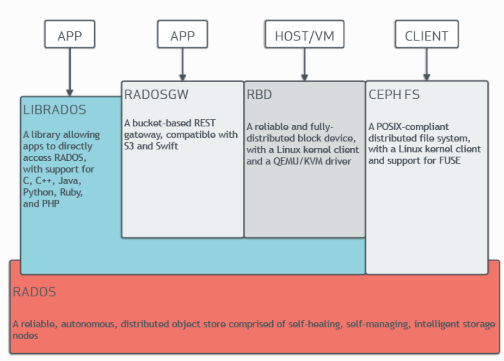
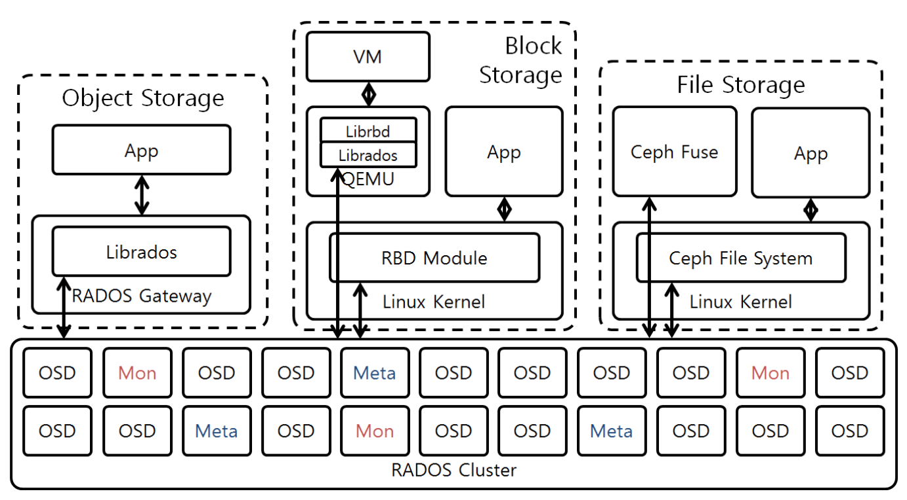
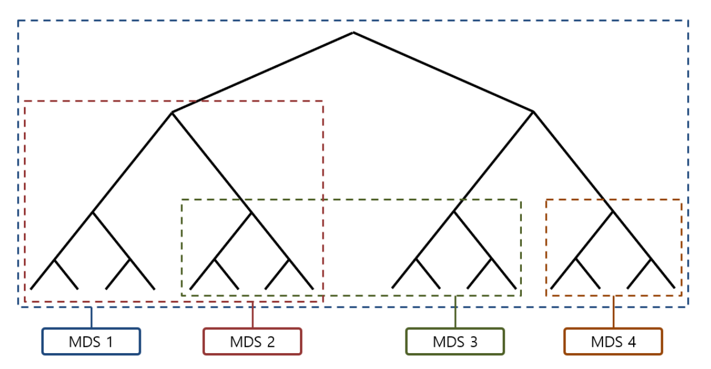
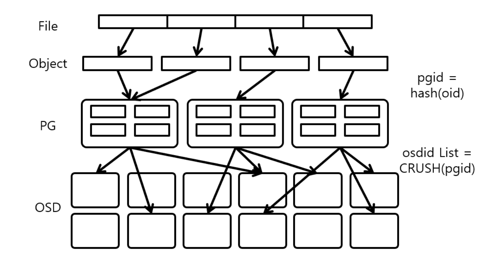
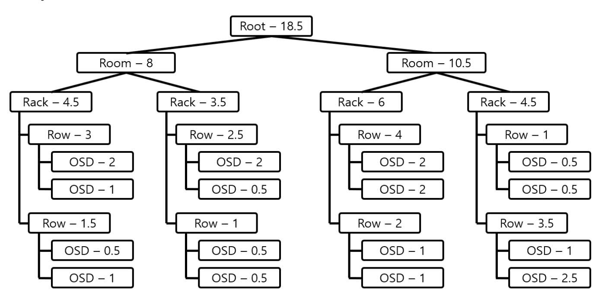
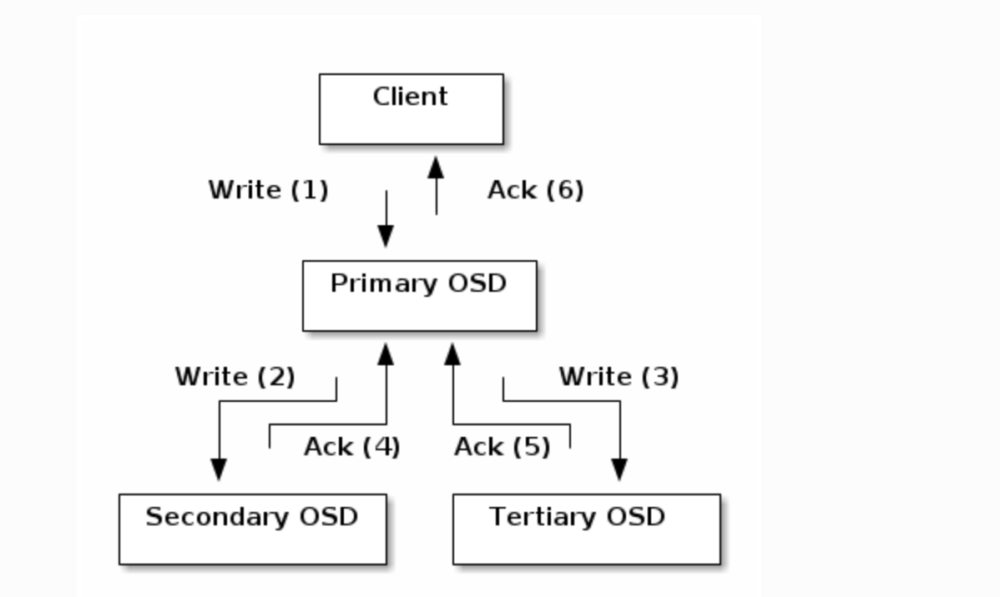
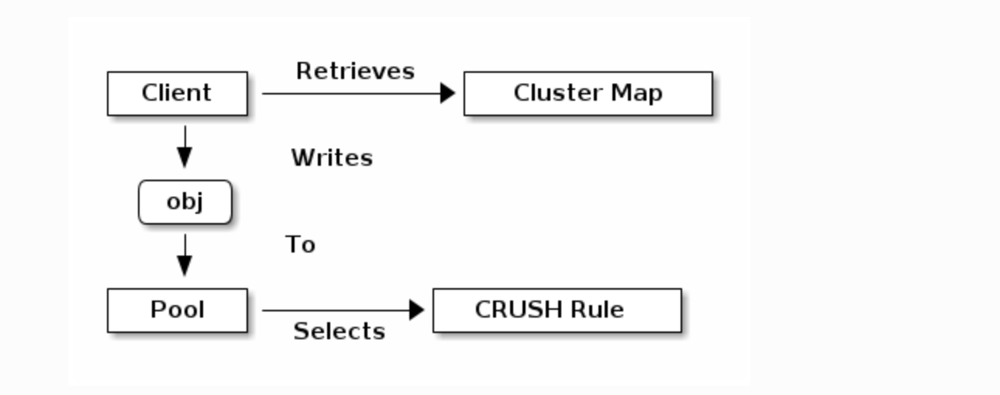
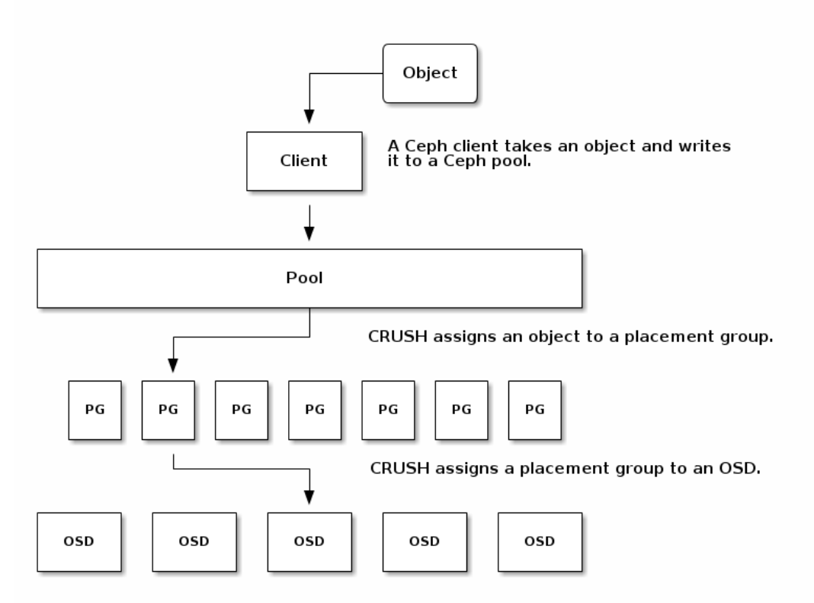
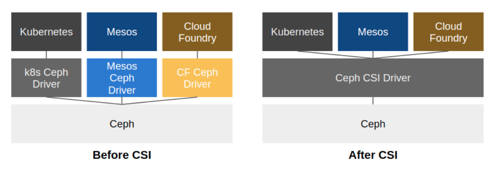

SDS(Software Defined Storage) 플랫폼이며 논리적 스토리지 Pool에 데이터를 Object로 저장한다.

가장 큰 특징 중 하나는 분산처리 방식으로, 특정 Node에 문제가 발생해도 ceph 동작에는 문제가 없도록 Single Point of Failure문제를 고려한 아키텍처를 채택한 것이다.





---

**Ceph Storage Cluster**

Ceph Storage Cluster는 여러 데몬이 포함된 RADOS 기반으로 이루어져있다. Ceph FIleSystem, Ceph Object Storage, Ceph Block Devices는 Ceph Storage Cluster에서 데이터를 읽고 쓴다. 위의 아키텍쳐에서 볼 수 있듯, 어떤 client 방식이든 RADOS Layer를 거쳐서 object로 저장한다.

---

**Storage 종류(w. Ceph Client 종류)**

- Object Storage

  Ceph가 Object Storage로 동작할때는 RADOS GW가 RADOS Cluster의 Client 역할과 Object Storage의 Proxy역할을 한다. RADOS GW는 RADOS Cluster 제어를 도와주는 LibRados를 이용하여 object를 저장하고 제어한다.

  App은 Amazon S3, OpenStack Swift와 호환되는 인터페이스가 있는 RESTful API를 이용한다.

  RADOS GW는 여러개를 운영하는것이 좋고, GW간의 로드밸런싱은 별도로 로드밸런서를 이용해야한다.

  > Librados는 TCP/IP통신 기반 raw socket을 사용하여 통신한다.

- Block Storage

  Ceph가 Block Storage로 동작할 때는 리눅스 커널의 RBD Module이나 Librados 기반의 LibRBD가 RADOS Cluster의 client가 된다. 스냅샷 및 복제 기능을 갖고 있는 block device 서비스를 제공한다. resizable하며 **thin-provisioned**하다.

  > **Thin Provision**
  >
  > 필요할 때 필요한 만큼 스토리지를 provisioning하여 효율적으로 데이터를 저장하는 것이다.

- File Storage

  Ceph가 File Storage로 동작할 때는 리눅스 커널의 Ceph File System이나 Ceph Fuse 데몬이 RADOS Cluster의 client가 된다. POSIX 호환되는 파일시스템을 제공한다.

  > MDS에 File System의 메타데이터가 저장되는데, 이는 동적으로 SubTree 파티셔닝을 가능하게 한다.

---

**RADOS Cluster**

데몬은 Ceph Monitor, Ceph Manager, Ceph OSD(Object Storage Daemon), Ceph MDS(Metadata Server)가 있다.

- Monitor (**ceph-mon**)

  Cluster State의 map을 유지관리한다. Cluster State에는 Monitor map, OSD map, PG map, MDS map, CRUSH map이 있다. 이 map은 ceph 데몬이 참고하는 중요한 클러스터 상태들이다.

  monitor는 데몬과 클라이언트간 인증 관리도 담당한다.

  HA를 위해서는 적어도 3개의 monitor가 있어야한다.

- Managers (**ceph-mgr**)

  Manager 데몬은 스토리지 활용도와 같은 ceph클러스터의 현재 상태와 런타임 메트릭을 추적하는 역할을 한다.

  HA를 위해 적어도 2개의 manager가 필요하다.

- OSDs (**ceph-osd**)

  OSD(Object Storage Daemon)은 데이터를 Object로 저장, 복제, 복구, 재조정하는 등의 역할을 한다. 다른 OSD 데몬을 확인하여 monitor와 manager에게 정보를 제공한다.

  디스크마다 하나의 OSD가 있다.

  > OSD 백엔드
  >
  > OSD가 저장하는 데이터를 관리하는 두가지 방법은 BlueStore, FileStore가 있다.
  >
  > - BlueStore
  >
  >   기본 백엔드로 권장
  >
  >   저장 장치를 직접 관리. RocksDB를 통한 메타데이터 관리. 효율적인 COW 등 Ceph OSD워크로드를 위해 디스크의 데이터를 관리하는데 특화된 스토리지 백엔드이다.
  >
  > - FileStore
  >
  >   BlueStore전에 기본 백엔드였고, 개체를 저장하는 레거시 접근방식
  >
  >   표준 파일 시스템에 의존한다.

  HA를 위해 적어도 3개의 OSD가 필요하다.

- MDSs (**ceph-mds**)

  MDS(Metadata Server)는 Ceph FileSystem을 대신하여 메타데이터를 저장한다. (Ceph Block Storage와 Object Storage는 MDS를 사용하지 않는다.)

  

  Ceph File System의 Namespace이다. (Ceph에서는 전체 Tree 또는 Sub Tree를 Namespace라고 한다.)

  각 MDS는 하나의 Namespace만 관리하고, 관리하는 Namespace와 연관된 Meta 데이터를 관리한다. Namespace는 tree의 부하상태 및 Replilca 상태에 따라 동적으로 바뀐다.

Ceph은 중앙의 lookup table을 참고하는게 아니라 Crush 알고리즘을 사용하여 pg(placement group)와 pg를 저장하는 osd를 직접 계산한다.

---

**CRUSH**



CRUSH(Controlled Replication Under Scalable Hashing)는 모든 데이터가 ceph 클러스터 전체에 적절하게 분산되고, 모든 클러스터 노드가 제약없이 빠르게 데이터를 가져올 수 있도록하는 해시 기반 알고리즘이다. CRUSH map을 기반으로 분산된다. 노드를 추가하거나 제거하여도 균형을 유지할 수 있게한다. 따라서 Ceph Storage Cluster가 동적으로 확장할 수 있게 한다.

CRUSH를 사용하면 중앙 인덱스 서버가 데이터 object 위치를 관리할 필요 없이 클라이언트가 storage device와 직접 통신할 수 있기 때문에 데이터를 빠르게 저장, 검색하고 쉽게 확장, 축소할 수 있는 것이다.



CRUSH Map은 Bucket이라는 논리적 단위의 계층으로 구성되며, Bucket은 root, region, datacentor, room, pod, pdu, row, rack, chassis, host, osd 11가지 type으로 구성되어 있다. CRUSH Map의 Leaf는 반드시 osd bucket이어야 한다.

각 Bucket은 Weight값이 있고, Weight값은 Bucket이 갖고 있는 Object의 비율을 나타낸다. 따라서 일반적으로 osd Bucket Type의 Weight값은 OSD가 관리하는 Disk용량에 비례하여 설정한다.

---

**Ceph의 Read/Write**

Ceph의 특징 중 하나는 Ceph Client가 OSD에 바로 접근하여 Object를 관리한다는 점이다. Client가 데이터를 읽고 쓰는 과정은 다음과 같다.

1. RADOS Cluster의 Monitor로부터 CRUSH Map정보를 얻는다.

2. CRUSH map과 CRUSH알고리즘을 이용하여 접근하려는 Object가 있는 pg와 pg가 있는 osd의 위치를 파악할 수 있다.

3. CRUSH 알고리즘으로 결정된 OSD 중 첫 OSD를 Primary OSD라고 하는데, Read의 경우 Primary OSD를 이용해 Read를 수행한다.

4. Write는 Primary OSD에게 Object와 같이 Object의 Replica가 저장될 추가 OSD정보도 같이 보낸다.

   그러면 Primary OSD는 Client로부터 Object를 다 받으면 나머지 OSD에게 전송한다. 모든 전송이 완료되면 Primary OSD는 Client에게 Write Ack를 전송한다.

   

---

**Pools**

Ceph Storage 시스템에는 객체 저장을 위해 논리 파티션인 Pools라는 개념이 있다.

Ceph Client는 Ceph Monitor로부터 Cluster Map을 가져오고, pool에 객체를 쓴다.

pool의 사이즈, replica 수, CRUSH 규칙, pg 개수에 따라 데이터가 어디 배치될지 결정된다.

각 pool은 여러개의 pg를 갖는데, client가 pool에 object를 전달하면 CRUSH는 object를 pg에 맵핑한다.



따라서 Pool에 객체의 소유/접근 권한, PG 개수, 사용할 CRUSH규칙을 설정해야한다.

---

**Placement Group (PG)**

PG는 Ceph Client와 OSD간 느슨한 결합을 한다. (Ceph OSD가 추가/삭제되어도 rebalance를 동적으로 할 수 있게 해준다.)

다음 다이어그램처럼, CRUSH가 Object를 PG에 맵핑하고, PG를 OSD에 맵핑한다.



Cluster map과 CRUSH알고리즘으로 client는 특정 object에 읽고 쓸떄 어떤 OSD를 사용해야하는지 계산할 수 있다.

Ceph는 전체 시스템에 사용가능한 Target pg수를 확인하고, 각 pool에 저장된 데이터 양을 확인하고, 그에 따라 pg를 할당하려고 한다. `pg_per_osd`는 하나의 osd가 pg에 분산되는 개수로, `mon_target_pg_per_osd` 값을 기반으로 책정되며, 따로 설정할수도 있다.

다음은 공식문서에서 제안하는 pg_per_osd값이다.

```
Target PGs per OSD This value should be populated based on the following guidance:
100 If the cluster OSD count is not expected to increase in the foreseeable future.
200 If the cluster OSD count is expected to increase (up to double the size) in the foreseeable future.
300 If the cluster OSD count is expected to increase between 2x and 3x in the foreseeable future.
```

---

**Ceph 프로토콜**

Ceph클라이언트는 Ceph Storage Cluster와 상호작용하기 위해 librados 라이브러리에 패키징된 프로토콜을 사용한다. 따라서 사용자 정의 Ceph 클라이언트를 생성할 수 있다.

---

**Ceph CSI**

Container Storage Interface(CSI) 이전에는, 각 스토리지 드라이버에 따른 설정 값을 추가했다. 이렇게 되면, 모든 스토리지 드라이버를 지원해야하는 문제가 있다. 이를 해결하기 위해 CSI를 정의하게 된다. 다양한 스토리지 드라이버가 존재하지만, 볼륨 생성, 삭제, 스냅샷 생성 등의 공통 기능이 존재하기 때문에 CSI는 공통 기능에 대한 인터페이스를 제공한다.



참고

- https://docs.ceph.com/en/latest/architecture/
- https://yeti.tistory.com/240
- https://ssup2.github.io/theory_analysis/Ceph/
- https://www.jacobbaek.com/594?category=624425
- https://www.youtube.com/watch?v=7I9uxoEhUdY
- https://docs.ceph.com/en/latest/rados/configuration/storage-devices/
- https://woohhan.tistory.com/18
