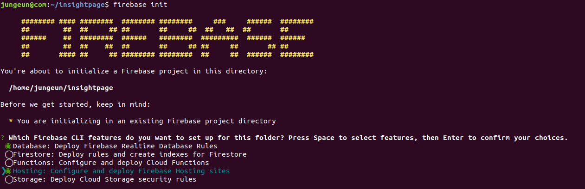
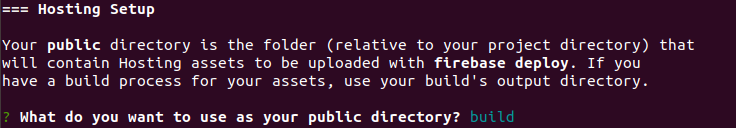

### npm 설치

우선 react의 패키지 관리자인 npm을 사용하기 위해 Nodejs를 설치한다.

```
$ sudo apt-get update
$ sudo apt-get install -y build-essential curl

$ curl -sL https://deb.nodesource.com/setup_10.x | sudo -E bash --
$ sudo apt-get install -y nodejs
```

`node -v`와 `npm -v`로 버전을 확인한다.

### React 설치

Create React App을 이용해 React를 설치한다.

```
$ sudo npm install -g create-react-app
$ create-react-app <app-name>
$ cd <app-name>
$ sudo npm run build
```

`npm run build`를 통해 build폴더가 생성됨을 볼 수 있다. 이 `build`폴더를 firebase에 기본폴더로 등록해야한다.

### Firebase 설치

우선 firebase CLI를 설치한다.

```
$ sudo npm install -g firebase-tools
```

그리고 [Firebase페이지](https://firebase.google.com/)로 가서 프로젝트를 추가한다. 클릭 몇번으로 간단히 만들 수 있다.

다시 터미널로 돌아와 `firebase login`을 하여 구글계정로그인을 하고 `firebase init`을 입력한다.



Fireabase의 어떤 기능을 설치할지 옵션을 선택한다. (본 프로젝트에선 Database와 Hosting기능 사용)

1. Project setup

   firebase웹에서 만든 프로젝트를 사용할 것이므로 **파이어베이스에 등록한 프로젝트를 선택**한다.

2. Database setup

   DB rule파일을 선택한다. 따로 설정할 것이 없으면 그냥 엔터누르면 된다

3. Hosting setup

   여기서 **기본 public directory를 build디렉터리로 지정**해야한다.

   

그럼 이제 설치가 완료 되었으므로 `firebase serve`를 하면 로컬에서 확인할 수 있다.

> **NOTE**
>
> 혹시 build폴더를 지정 시 권한오류가 난다면 build디렉터리의 소유자가 누구인지 확인한다.
>
> 소유자가 사용자와 다른 경우 오류가 난다. 이 경우 chown으로 소유자를 변경해준다.

### Firebase 배포

호스팅 기능을 활성화했으므로 실제 서버에 프로젝트를 올려보자. `npm run build`와 `firebase deploy`를 한번에 하기 위해 `package.json`에 다음 script를 추가한다.

```
"scripts": {
	// ...
    "deploy": "react-scripts build && firebase deploy"
}
```

`sudo npm run build`를 입력한 후 배포된 것을 확인해본다.

### React에서 Firebase기능 사용하기

DB나 사용자 인증 등 firebase의 기능을 사용하기 위해 firebase module을 설치한다.

```
$ sudo npm install -S firebase
```

### React에서 Firebase 구성 객체 가져오기

firebase 웹콘솔로 접속하여 웹앱만들기를 하고나서 얻은 snippet의 config부분을 저장해놓는다.

1. Firebase SDK를 설치한다.

   `package.json`파일이 없으면 `sudo npm init`을 먼저 수행한다. 그리고 `sudo npm install --save firebase`를 실행한다.

2. `shared/firebaseConfig.js`파일을 만들어 위에서 받은 Firebase 프로젝트의 snippet정보를 저장한다.

   ```
   export default firebaseConfig = {
     apiKey: "...",
     authDomain: "...",
     databaseURL: "...",
     projectId: "...",
     storageBucket: "...",
     messagingSenderId: "...",
     appId: "..."
   };
   ```

3. `shared/firebaseInit.js`파일에선 firebase를 초기화한다.

   ```
   import * as firebase from "firebase/app";
   import "firebase/auth";
   import "firebase/database";
   import firebaseConfig from './firebaseConfig';

   firebase.initializeApp(firebaseConfig);
   ```

   본 프로젝트에선 auth와 database sdk를 사용하므로 두가지만 import했다. [sdk모듈정보](https://firebase.google.com/docs/web/setup?authuser=0#add-sdks_bundle)에서 사용할 sdk 모듈을 import한다.
